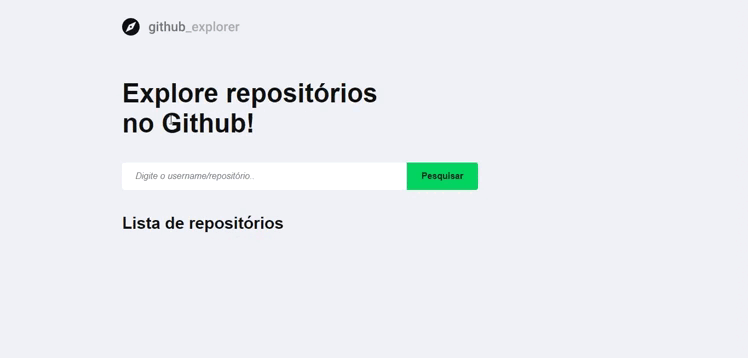

<h1 align="center">
  
</h1>

<p align="center">
     
</p>

<p align="center">
  <a href="#-tecnologias">Tecnologias</a>&nbsp;&nbsp;&nbsp;|&nbsp;&nbsp;&nbsp;
  <a href="#-projeto">Projeto</a>&nbsp;&nbsp;&nbsp;|&nbsp;&nbsp;&nbsp;
  <a href="#-como-usar?">Como usar?</a>&nbsp;&nbsp;&nbsp;&nbsp;&nbsp;&nbsp;
</p>

## 🛠 Tecnologias 🚀

Este projeto foi desenvolvido com as seguintes tecnologias:

- <a href="https://pt-br.reactjs.org/">React</a>
- <a href="https://sass-lang.com/">SASS</a>
- <a href="https://www.typescriptlang.org/">Typescript</a>
- <a href="https://pt-br.reactjs.org/docs/hooks-intro.html">Hooks</a>
- <a href="https://react-icons.github.io/react-icons/">React-Icons</a>
- <a href="https://webpack.js.org/">Webpack</a>
- <a href="https://babeljs.io/">Babel</a>
- <a href="https://yarnpkg.com/">Yarn</a>

## 💻 Projeto

<p>Github-explorer é uma página simples para listagem e armazenamento em cachê de repósitorios interessantes do github.</p>
<p>O principal objetivo da aplicação foi é o de poder armazenar repositórios em que o usuário possa vir a querer visitar futuramente, possibilitando assim que o repositório quando salvo na página leve o usuário ao repositório original do github através de um link.</p>
<p>Para que isso fosse possível utilizou-se então a API do github para buscar os dados referentes ao repositório desejado, e o localStorage para armazenamento dos dados em cachê.</p>
<p>Um dos própositos da criação da página foi o de compreender conceitos referentes a 'webpack' e 'babel', de forma a aplicar toda a teoria através da prática dentro do projeto.</p>


## ⌨ Como usar?

Em primeiro lugar, clone o repositório:

```bash
# Clonando o repositório
git clone https://github.com/hitaloalvess/github-explorer.git

# ✅ Em sequência:

# Instale as dependências:
yarn install

# Iniciando projeto
yarn dev
```

---
Made with ♥ by Hitalo 🚀